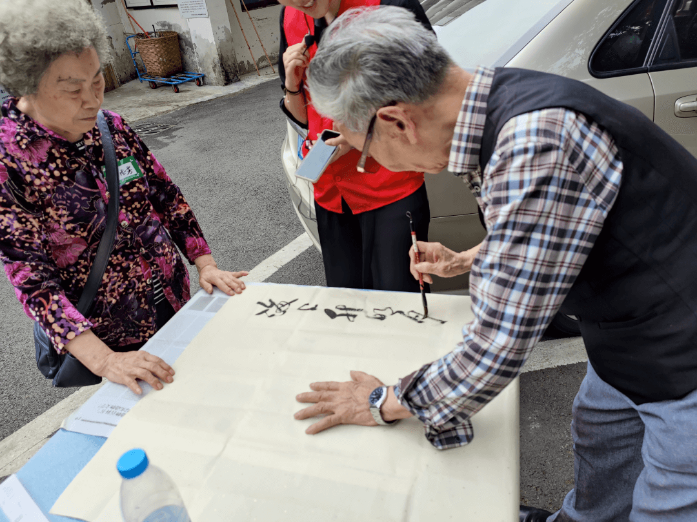

import { imageGalleryContainer } from "./Gallery.module.scss";
import GalleryVideo from "../../components/GalleryVideo";

<PageDescription>

喜悦，与你分享；
成长，一同铸就。

</PageDescription>

<ImageGallery>

<ImageGalleryImage alt="作品展示" title="作品展示1" col={4}>

</ImageGalleryImage>

<ImageGalleryImage alt="作品展示" title="作品展示2" col={4}>

</ImageGalleryImage>

<ImageGalleryImage alt="博物馆" title="参观博物馆" col={4}>

</ImageGalleryImage>

<ImageGalleryImage alt="泸州" title="泸州" col={4}>

</ImageGalleryImage>

<ImageGalleryImage alt="泸州" title="泸州" col={4}>

</ImageGalleryImage>

<ImageGalleryImage alt="表演" title="表演" col={4}>

</ImageGalleryImage>

<ImageGalleryImage alt="书法" title="书法" col={4}>

</ImageGalleryImage>

<ImageGalleryImage alt="I盖章" title="盖章" col={4}>

</ImageGalleryImage>

<ImageGalleryImage alt="小小志愿者d" title="小小志愿者d" col={4}>

</ImageGalleryImage>

<ImageGalleryImage alt="活动签到" title="活动签到" col={4}>

</ImageGalleryImage>

<ImageGalleryImage alt="活动主持" title="活动主持" col={4}>

</ImageGalleryImage>

<ImageGalleryImage alt="小助手" title="小助手" col={4}>

</ImageGalleryImage>

<ImageGalleryImage alt="美丽村小" title="美丽村小" col={6}>

</ImageGalleryImage>

<ImageGalleryImage alt="儿童自护" title="儿童自护" col={6}>

</ImageGalleryImage>

<ImageGalleryImage alt="茜草" title="茜草" col={4}>

</ImageGalleryImage>

<ImageGalleryImage alt="茜草" title="茜草" col={4}>

</ImageGalleryImage>

<ImageGalleryImage alt="茜草" title="茜草" col={4}>

</ImageGalleryImage>

<ImageGalleryImage alt="茜草" title="茜草" col={4}>

</ImageGalleryImage>

<ImageGalleryImage alt="茜草" title="茜草" col={4}>

</ImageGalleryImage>

<ImageGalleryImage alt="茜草" title="茜草" col={4}>

</ImageGalleryImage>

</ImageGallery>

