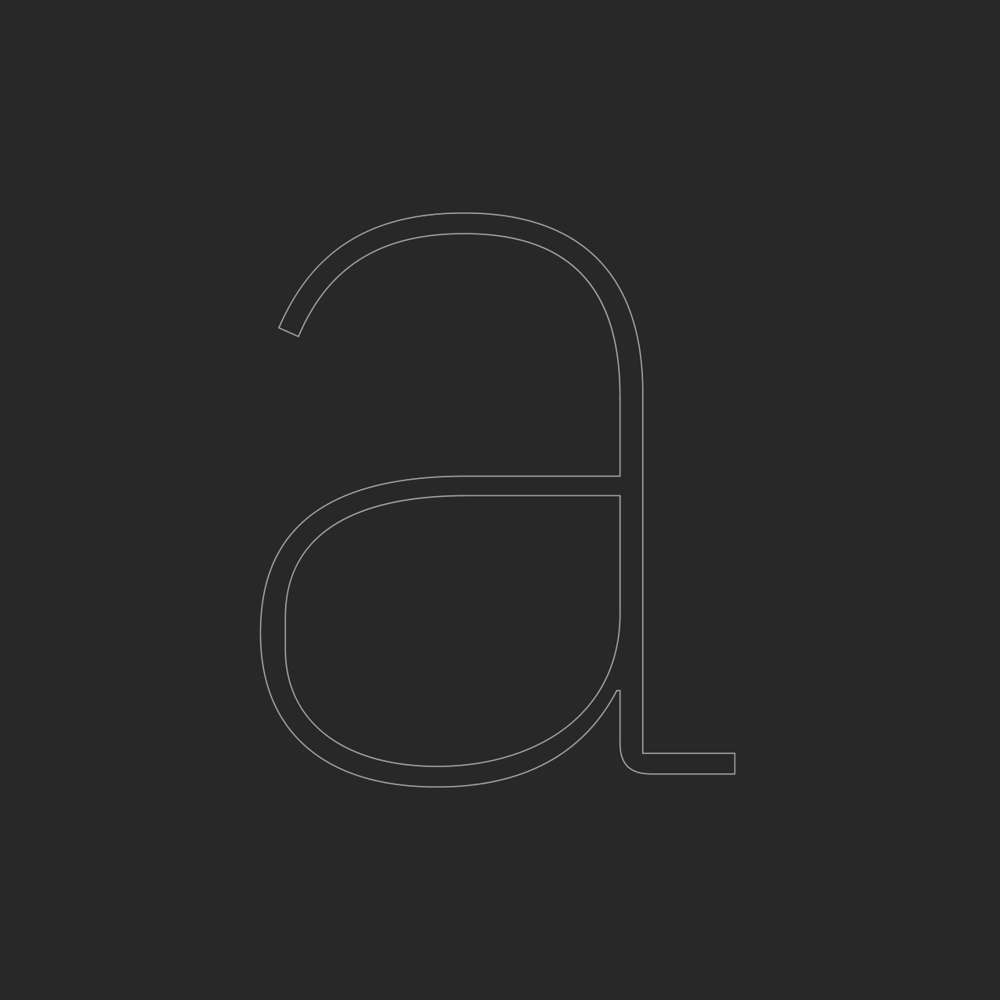
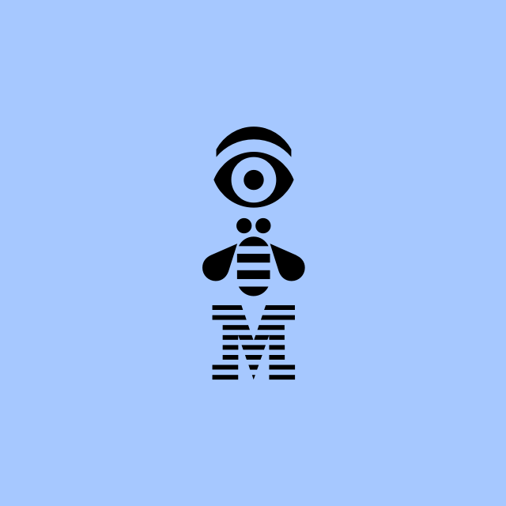
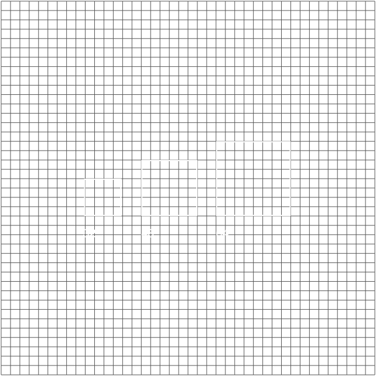
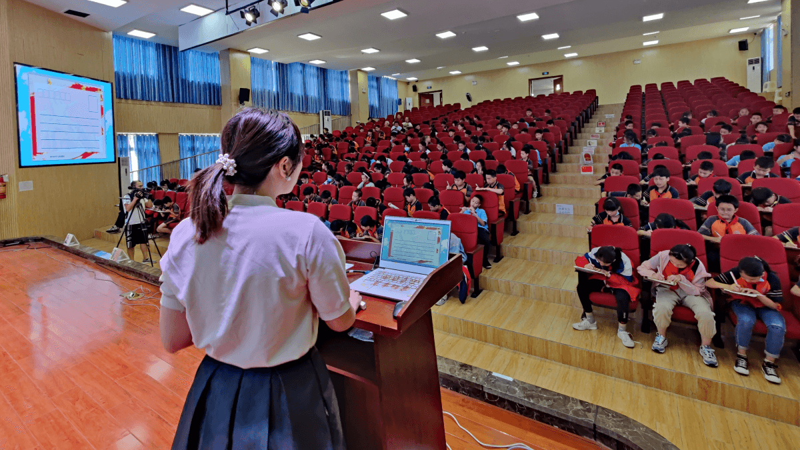
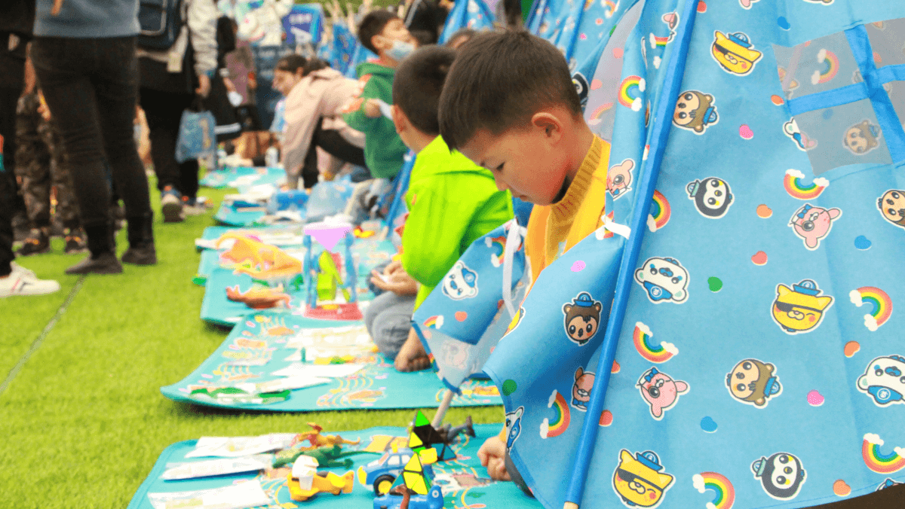

import HomepageTemplate from "gatsby-theme-carbon/src/templates/Homepage";
import { h3 } from "gatsby-theme-carbon/src/components/markdown/Markdown.module.scss";
import HomepageTile from "../components/HomepageTile";
import Carousel from "../components/Carousel";
import Helmet from "../components/Helmet";
import { noGutterSm, noGutterMdLeft } from "../styles/Grid.module.scss";
import "../styles/index.scss";

export default HomepageTemplate;

<Helmet />

<Row className="image-card-group">
  <Column colLg={4} colMd={4} noGutterSm>
    <ImageCard
      title="Typeface"
      href="/typography/typeface"
      actionIcon="arrowRight"
      titleColor="light"
      iconColor="light"
      className="card-background"
      >

  </ImageCard>
  </Column>
  <Column colLg={4} colMd={4} noGutterSm>
    <ImageCard
        title="Philosophy"
        aspectRatio="1:1"
        href="/philosophy/pov"
        actionIcon="arrowRight"
        iconColor="dark"
        titleColor="dark"
        className="card-background"
        >

  </ImageCard>
  </Column>
  <Column colLg={4} colMd={4} noGutterSm>
    <ImageCard
        title="Color"
        aspectRatio="1:1"
        href="/color"
        actionIcon="arrowRight"
        iconColor="light"
        titleColor="light"
        className="card-background"
        >

  </ImageCard>
  </Column>
  <Column colLg={8} noGutterSm>
    <ImageCard
        title="Photography"
        aspectRatio="1:1"
        href="/photography/overview"
        actionIcon="arrowRight"
        iconColor="light"
        titleColor="dark"
        className="card-background"
        >

  </ImageCard>
  </Column>
  <Column colLg={4} colMd={4} noGutterSm>
    <ImageCard
        title="Illustration"
        aspectRatio="1:1"
        href="/illustration/overview"
        actionIcon="arrowRight"
        iconColor="light"
        titleColor="light"
        className="card-background"
        >

  </ImageCard>
  <ImageCard
    title="2x Grid"
    href="/2x-grid"
    actionIcon="arrowRight"
    titleColor="light"
    iconColor="light"
    className="card-background"
    >

</ImageCard>
</Column>
</Row>

<h2 classname={h3}>最 新 动 态</h2>

<Row>
  <Column colMd={4} colLg={4} noGutterMdLeft>
    <ArticleCard
      title="烈士陵园"
      author="泸州市邻萌社区服务中心"
      date="2021 年 9 月"
      href="/whats-new#2021-09-30"
      actionIcon="arrowRight"
      color="dark"
    >

  </ArticleCard>
  </Column>

  <Column colMd={4} colLg={4} noGutterMdLeft>
    <ArticleCard
      title="安全防溺水活动"
      author="泸州市邻萌社区服务中心"
      date="2021 年 7 月"
      href="/whats-new#2021-07-21"
      actionIcon="arrowRight"
      color="dark"
    >

  </ArticleCard>
  </Column>

  <Column colMd={4} colLg={4} noGutterMdLeft>
    <ArticleCard
      title="泸州万达义卖活动"
      author="泸州市邻萌社区服务中心"
      date="2021 年 3 月"
      href="/whats-new#2021-03-21"
      actionIcon="arrowRight"
      color="dark"
    >

  </ArticleCard>
  </Column>
  
</Row>
