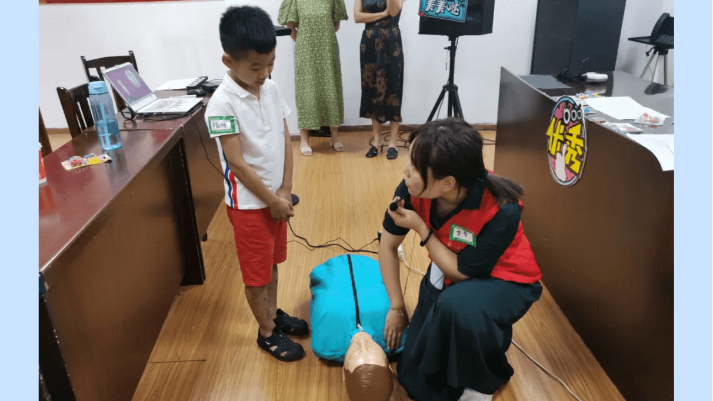

import HomepageTemplate from "gatsby-theme-carbon/src/templates/Homepage";
import { h3 } from "gatsby-theme-carbon/src/components/markdown/Markdown.module.scss";
import HomepageTile from "../components/HomepageTile";
import Carousel from "../components/Carousel";
import Helmet from "../components/Helmet";
import { noGutterSm, noGutterMdLeft } from "../styles/Grid.module.scss";
import "../styles/index.scss";

export default HomepageTemplate;

<Helmet />

<Row className="image-card-group">
  <Column colLg={4} colMd={4} noGutterSm>
    <ImageCard
      title="机构理念"
      aspectRatio="1:1"
      href="/philosophy/principles"
      actionIcon="arrowRight"
      titleColor="light"
      iconColor="light"
      className="card-background"
      >

  </ImageCard>
  </Column>
  <Column colLg={4} colMd={4} noGutterSm>
    <ImageCard
        title="机构视角"
        aspectRatio="1:1"
        href="/philosophy/pov"
        actionIcon="arrowRight"
        iconColor="light"
        titleColor="light"
        className="card-background"
        >

  </ImageCard>
  </Column>
  <Column colLg={4} colMd={4} noGutterSm>
    <ImageCard
        title="常见问题"
        aspectRatio="1:1"
        href="/help/faq"
        actionIcon="arrowRight"
        iconColor="light"
        titleColor="light"
        className="card-background"
        >

  </ImageCard>
  </Column>
  <Column colLg={8} noGutterSm>
    <ImageCard
        title="相册"
        aspectRatio="1:1"
        href="/gallery"
        actionIcon="arrowRight"
        iconColor="dark"
        titleColor="light"
        className="card-background"
        >

  </ImageCard>
  </Column>
  <Column colLg={4} colMd={4} noGutterSm>
    <ImageCard
        title="微博"
        aspectRatio="1:1"
        href="https://weibo.com/menggongyi?nick=%E9%82%BB%E8%90%8C%E7%A4%BE%E5%8C%BA%E6%9C%8D%E5%8A%A1%E4%B8%AD%E5%BF%83&is_all=1"
        actionIcon="arrowRight"
        iconColor="light"
        titleColor="light"
        className="card-background"
        >

  </ImageCard>
  <ImageCard
    title="语雀"
    aspectRatio="1:1"
    href="https://www.yuque.com/linmengshequ"
    actionIcon="arrowRight"
    titleColor="light"
    iconColor="light"
    className="card-background"
    >

</ImageCard>
</Column>
</Row>

<h2 classname={h3}>最新动态</h2>

<Row>
  <Column colMd={4} colLg={4} noGutterMdLeft>
    <ArticleCard
      title="烈士陵园"
      author="泸州市邻萌社区服务中心"
      date="2021 年 9 月"
      href="/whats-new#2021-09-30"
      actionIcon="arrowRight"
      color="dark"
    >

  </ArticleCard>
  </Column>

  <Column colMd={4} colLg={4} noGutterMdLeft>
    <ArticleCard
      title="安全防溺水活动"
      author="泸州市邻萌社区服务中心"
      date="2021 年 7 月"
      href="/whats-new#2021-07-21"
      actionIcon="arrowRight"
      color="dark"
    >

  </ArticleCard>
  </Column>

  <Column colMd={4} colLg={4} noGutterMdLeft>
    <ArticleCard
      title="泸州万达义卖活动"
      author="泸州市邻萌社区服务中心"
      date="2021 年 3 月"
      href="/whats-new#2021-03-21"
      actionIcon="arrowRight"
      color="dark"
    >

  </ArticleCard>
  </Column>
  
</Row>
