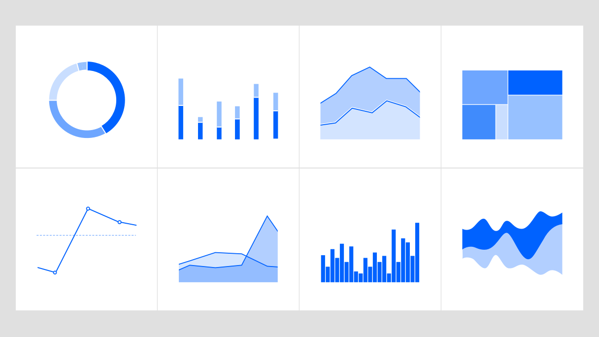

import { PageDescription, AnchorLinks, AnchorLink } from "gatsby-theme-carbon";
import { gridImages } from "../../styles/Grid.module.scss";

<PageDescription>

邻萌社区服务中心总是把需求放在第一位，根据受众的年龄，知识，经验等来规划我们的活动或服务。这里有最新的一些活动简讯，供大家了解。

</PageDescription>

### 2021-09-30

<Row className={gridImages}>
<Column colLg={8} colMd={6}>

[](https://kscgc.sctv.com/sctv/h5/shared/v5/proback_shared.html?newsId=80732&newsJson=https://kscgc.sctv.com/sctv/lookback/3/2021/09/30/20210930.json?programmeUrl=https://fscgc.sctv.com/NewsMedia/2021/09/30/jrsd202109300011.mp4&programmeTitle=%E4%BB%8A%E5%A4%A9%E9%B2%9C%E8%8A%B1%E7%8C%AE%E7%BB%99%E8%8B%B1%E7%83%88%E2%80%94%E2%80%94%E5%A4%9A%E5%9C%B0%E4%B8%BE%E8%A1%8C%E7%83%88%E5%A3%AB%E7%BA%AA%E5%BF%B5%E6%97%A5%E5%85%AC%E7%A5%AD%E6%B4%BB%E5%8A%A8&programmeImage=/sctv/1/image/public/202109/20210930182516_6d1axlv3u4.jpg&programmeId=80732)

<Caption>点击图片查看原文</Caption>

</Column>
</Row>

#### 烈士事迹进校园 —  

第十三届全国人民代表大会常务委员会第二次会议通过《中华人民共和国英雄烈士保护法》，将每年 9 月 30 日定为烈士纪念日。我们在这一天组织江阳区邮协的老辈子和志愿者一同前往长江小学为六年级的同学开展了一堂烈士纪念的主题教育课程。为大家讲解了新中国成立前、中、后期那些为了革命事业和祖国发展二英勇牺牲的前辈。让同学们为烈士陵园祭奠的英灵写了一张明信片。同学们表达对革命先烈的崇敬和怀念。本次活动教育了即将迈入人生新阶段的同学们要珍惜当下的生活，是烈士们的无畏奉献，才有了我们今天的生活。

### 2021-07-21

<Row className={gridImages}>
<Column colLg={8} colMd={6}>

<Caption>点击图片查看原文</Caption>

</Column>
</Row>

#### 安全防溺水 —  

在我国，每年约有 5.5 万名未成年人意外死亡。溺水、交通事故是未成年人意外死亡的主要原因。据教育部统计，农村地区非正常死亡学生占总数近 80%。我国监测数据显示，溺水、道路交通伤害及跌落是儿童伤害死亡及发生的最主要伤害类型。百子图社区紧邻沱江河畔，暑期是青少年儿童溺水事故高发期。因此，为青少年儿童进行安全防溺水宣讲刻不容缓。此次活动，帮助孩子们掌握了防溺水的一些措施和方法，提高了自我防范意识和自护、自救及互救的能力，更加直观地学习防溺水安全知识，让孩子们树立珍爱生命、敬畏生命的安全意识，让安全伴随每个孩子，每个家庭。

### 2021-03-12

<Row className={gridImages}>
<Column colMd={6} colLg={8}>

<Caption>点击图片查看原文</Caption>

</Column>
</Row>

#### 泸州万达义卖活动 —  

我们非常高兴能够举办这样一系列的义卖活动，丰富学生课外经历的同时，最主要的是为乡村小学的同学募集更多的社会闲置资源，
有书籍，有运动器材，有玩具，有乐器。给了城市与乡村一个沟通的平台。让城市小朋友认识到自己所处环境和乡村小朋友的差距。

<!-- ## 安全防溺水主题活动

<Row>
<Column colLg={8} colMd={6}>

<GifPlayer className="video-player" color="white">

<Video autoPlay playsInline loop="on" muted src="./videos/ibm-red-hat.mp4" />

</GifPlayer>

</Column>
</Row>

在我国，每年约有 5.5 万名未成年人意外死亡。溺水、交通事故是未成年人意外死亡的主要原因。据教育部统计，农村地区非正常死亡学生占总数近 80%。我国监测数据显示，溺水、道路交通伤害及跌落是儿童伤害死亡及发生的最主要伤害类型。百子图社区紧邻沱江河畔，暑期是青少年儿童溺水事故高发期。因此，为青少年儿童进行安全防溺水宣讲刻不容缓。

此次活动，帮助孩子们掌握了防溺水的一些措施和方法，提高了自我防范意识和自护、自救及互救的能力，更加直观地学习防溺水安全知识，让孩子们树立珍爱生命、敬畏生命的安全意识，让安全伴随每个孩子，每个家庭。 —  2021 年 7 月 21 日

## Expressive pictograms

<Row className={gridImages}>
<Column colLg={8} colMd={6}>

</Column>
</Row>

IBM Design Language is a dynamic system that continually builds on the existing elements. Expressive pictograms are a natural evolution in our iconography portfolio. If you are looking for a different way to add bold graphic interest to your work, consider expressive pictograms. Based on our popular pictograms, these graphic elements pop with the considered application of color. Gradients are particularly striking on expressive pictograms as you convey brand-specific color palettes in your work. Learn about the differences between [pictogram types](/iconography/pictograms/design/#pictogram-types), how [pictogram strokes](/iconography/pictograms/design/#expressive-pictogram-strokes) differ, and how to [apply color to expressive pictograms](/iconography/pictograms/design/#expressive-pictogram-color) on the IBM Design Language [Pictograms Design](/iconography/pictograms/design/) page. —  12 May, 2021 -->

<!-- ## Illustration starter kits

<Row>
<Column colLg={8} colMd={6}>

</Column>
</Row>

Do you need to create illustrations? We’ve built Adobe Illustrator starter kits to help you accelerate your proficiency in building compelling, on-brand illustrations. In them you’ll find basics like grids, a primer on the underlying anatomy of each style and a foundational set of simple elements you can use alone or recombine to form your own new illustration narratives. Each kit includes an inspiration gallery of examples showing techniques. These examples aren’t a library of ready-made art; they’re solely provided to help inform your explorations. Use them to study and deconstruct the technical aspects of these versatile styles. Find the kits for [line](https://www.ibm.com/design/language/illustration/line-style/design#resources), [flat](https://www.ibm.com/design/language/illustration/flat-style/design#resources) or [isometric](https://www.ibm.com/design/language/illustration/isometric-style/design#resources) style art here, and learn more about [illustration](https://www.ibm.com/design/language/illustration/overview/) at IBM. —  09 February, 2021

## Iconography contributions

<Row>
<Column colLg={8} colMd={6}>

</Column>
</Row>

The IBM Design Language now has over 500 [pictograms](https://www.ibm.com/design/language/iconography/pictograms/library) and 1,000 [UI icons](https://www.ibm.com/design/language/iconography/ui-icons/library) available for download. Pictograms are used across IBM, from websites and events to merchandise and brochures. Our UI icons are specially sized for user interface applications, purposefully built into IBM products and web pages. Though pictograms and UI icons are small, they play a mighty role in embedding the IBM Design Language deep in our brand. We welcome designers who want to contribute to our libraries. Whether you have just one concept or a whole batch of new ideas, discover how to submit your artwork to our [UI icons](https://www.ibm.com/design/language/iconography/ui-icons/contribute) and [Pictograms](https://www.ibm.com/design/language/iconography/pictograms/contribute) libraries. —  22 October, 2020

## App icons library

<Row className={gridImages}>
<Column colLg={8} colMd={6}>

</Column>
</Row>

IBM app icons are expressive and distinct, visually communicating the core idea of a product or service in objective or abstract form. Across web platforms, product marketplaces and in native applications, these icons help users identify apps at a glance. To find out more about these important brand elements, visit our [app icon library](https://www.ibm.com/design/language/iconography/app-icons/library) in the Iconography section of IBM Design Language. From there, you can find an overview of how to [design app icons](https://www.ibm.com/design/language/iconography/app-icons/design), plus guidance for [app icon usage](https://www.ibm.com/design/language/iconography/app-icons/usage) and [production](https://www.ibm.com/design/language/iconography/app-icons/production). —  06 October, 2020

## Logo requests

<Row className={gridImages}>
<Column colLg={8} colMd={6}>

</Column>
</Row>

Our corporate identity is the IBM name and the IBM 8-bar logo. The way in which we apply both is a reflection of the IBM business strategy—to be a single, globally integrated enterprise. Wherever it appears, the IBM name and logo should always maintain and build the strength of the IBM brand. The [logo request](http://www.ibm.com/brand/ibm-logos/logo-requests/) page can help you secure the proper approvals and images to protect our valuable logo asset. On it, logo downloads are available for IBMers and approved IBM suppliers who are required to adhere to certain terms and conditions to protect against misuse. An IBMid is required for downloads. —  25 September, 2020

## Animation guidance

<Row>
<Column colLg={8} colMd={6}>

<Video title="Animation" vimeoId="425895830" />

</Column>
</Row>

At IBM, our forward progress is constant, and every move reflects the need to be
essential. When using animation, every element we set in motion is an extension
of our voice—it must serve a purpose, embody precision and communicate clearly.
We use several animation styles to serve a wide range of needs. Whether using
line, flat or isometric style, effective animation is simple yet concise and
engineered. See examples and guidance on the IBM Design Language
[Animation](https://www.ibm.com/design/language/animation/overview/)
pages. —  01 September, 2020

## IBM Developer Experience Guide

<Row className={gridImages}>
<Column colMd={6} colLg={8}>

</Column>
</Row>

The IBM Developer Experience Guide details how we work to build deeper
relationships with enterprise developers around the world. Written and designed
to reflect the brand promise statement—Build Smart. Build Secure.—the guide
exemplifies the clean, direct approach developers appreciate. Learn more about
how to express the advantage IBM developers have when building solutions using
our technology and resources. Find the
[IBM Developer Experience Guide](https://www.ibm.com/brand/systems/developer/)
under Brand Systems. —  30 July, 2020

## IBM Plex® Sans Korean

<Row className={gridImages}>
<Column colMd={6} colLg={8}>

</Column>
</Row>

We are continuously working to extend the IBM Plex® typeface family
internationally. After over a year of development effort, we’re proud to release
IBM Plex Sans KR. This Korean language typeface is the first of our rigorous and
on-going Plex CJK project, which will include Chinese and Japanese, as well. IBM
Plex Sans KR is available in all eight weights and includes hinting for
optimized performance in digital environments. IBM Plex Sans KR is open source
and now available to [download](https://github.com/IBM/plex/releases/latest) on
GitHub. To see how the typeface looks, play with it or any of the Plex scripts
using our Typetester tool on the
[Typeface](https://www.ibm.com/design/language/typography/typeface#type-tester)
page. —  10 June, 2020

## Illustration guidance

<Row className={gridImages}>
<Column colMd={6} colLg={8}>

</Column>
</Row>

IBM builds systems and services to help our clients reduce and solve problems
every day. Our illustrations have a distinct purpose as well—to communicate
difficult concepts at a glance, in diverse and delightful ways. Nimble
illustrations help users understand complex ideas. They uphold the engineered
nature of the IBM brand through precise adherence to the grid, along with
consistent use of a system of angles, shapes and radii. Learn more about how we
use line, flat and isometric style to craft visual elements that extend our rich
visual history in
[Illustration](https://www.ibm.com/design/language/illustration/overview). —

 
23 March, 2020

## Data visualization guidance

<Row className={gridImages}>
<Column colMd={6} colLg={8}>

</Column>
</Row>

Usable data is a central value IBM provides to our customers. Accurate,
understandable data visualization relies on clarity delivered through typography
using visual models that employ structure, contrast and rhythm. Consistency in
style and scale provides user confidence in the integrity of data. Context
maximizes the environmental constraints to enhance audience comprehension of the
data. Now the IBM Design Language provides a distinctive rationale for visual
representation of the IBM brand. Use this new guidance to create on-brand
[data visualization](https://www.ibm.com/design/language/data-visualization/overview)
with impact. —  23 March, 2020

## Stationery system

<Row className={gridImages}>
<Column colMd={6} colLg={8}>

</Column>
</Row>

The [IBM stationery](https://www.ibm.com/brand/stationery/) (IBMid Required)
system has been redesigned to be a modern statement of our brand expression. The
new business card is one universal size on your choice of blue or white card
stock and provides the flexibility to use multiple languages or social media
handles. The letterhead, envelopes and mailing labels are available in US and
ISO sizes with shipping envelopes. A phased rollout to markets worldwide begins
Q1 2020 and into 2021. Learn more and check the schedule for availability and
adhere to purchasing policies for your business unit and market. —  13
February, 2020

## Pictogram library

<Row className={gridImages}>
<Column colMd={6} colLg={8}>

</Column>
</Row>

We have a new library with over 400 pictograms available to use and even more to
come in the next release. Along with the library comes an
[.ai master file](https://github.com/carbon-design-system/carbon/raw/master/packages/pictograms/master/pictogram-master.ai)
with all the pictograms organized by category. This library and master file will
serve as the single source of truth representing the latest and approved
pictograms. If you need pictograms or want to contribute, please follow the
guidance outlines
[here](https://www.ibm.com/design/language/iconography/pictograms/contribute/)
and check out the
[library](https://www.ibm.com/design/language/iconography/pictograms/library/). —

 9 October, 2019

## Search and filtering

<Row className={gridImages}>
<Column colMd={6} colLg={8}>

</Column>
</Row>

This cycle, we released a major enhancement to our
[UI Icon](https://www.ibm.com/design/language/iconography/ui-icons/library) and
[Pictogram](https://www.ibm.com/design/language/iconography/ui-icons/library)
libraries by adding search and category filtering, making it much easier to find
what you’re looking for!  —  9 October, 2019 -->
